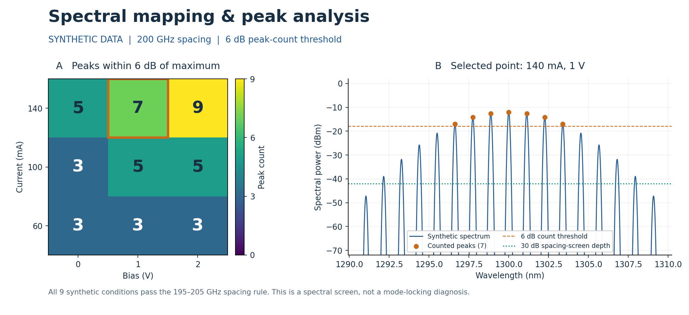
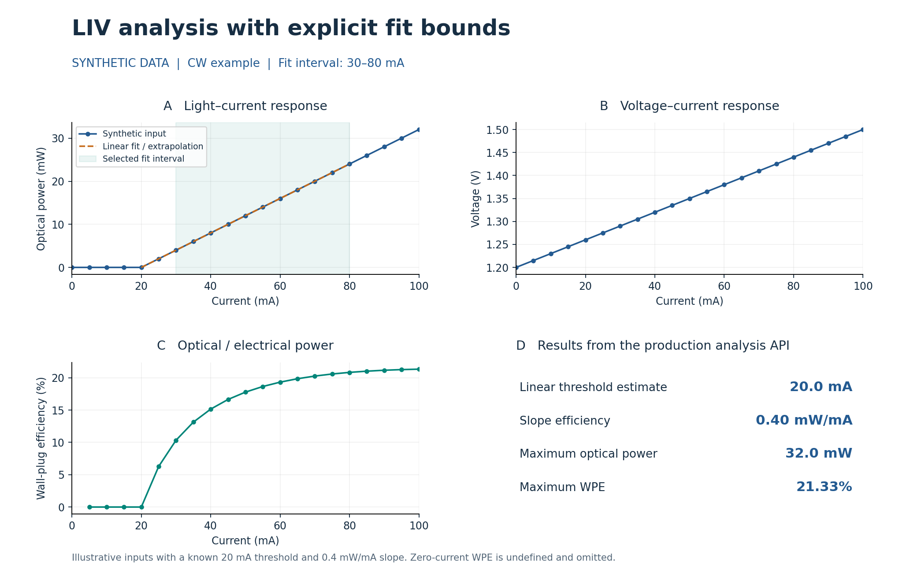

# 激光器表征工具箱

首版包含两个模块：浏览器中的交互光谱映射，以及 Python LIV 分析命令行。
工具来自真实实验需求，代码由 Sen Hu 使用 Codex 开发，采用 MIT 许可证。
仓库中的演示曲线均为合成数据，未附带实验室测量数据。

## 示例结果

### 光谱映射与谱峰筛选

左图展示不同电流与偏压标签下的谱峰计数，右图展开其中一个条件：
最大峰值以下 6 dB 范围内有 7 个谱峰。谱峰间距筛选另采用 30 dB 深度及
195–205 GHz 区间，两种阈值的用途在图中分别标明。

### LIV 曲线与参数提取

示例显示功率—电流、电压—电流及墙插效率曲线。指定 30–80 mA 拟合区间后，
线性外推阈值为 20 mA，斜率效率为 0.4 mW/mA；可结合原始曲线检查参数的含义。

两张图均由**合成输入调用项目内实际分析代码**生成，用于说明分析流程，
不是实验测量结果或网页界面截图。生成脚本、数值结果及复现命令见[示例说明](docs/examples.md)。

## 使用方式

- 打开 `web/index.html` 即可查看合成光谱地图、调节筛选条件、选点和缩放。
- 导入自己的光谱时，一个文件夹只放同一器件、同一温度的数据。
  推荐文件名如 `sample42_I100mA_V1.5V.txt`，两列数据为 nm 和 dBm。
  原实验室文件名规则可通过下拉选项显式启用。
- LIV 安装、运行与测试命令见 [英文首页](README.md)。输入列必须标明单位，
  拟合区间由使用者指定，输出包含参数、警告、输入哈希和软件版本。

光谱结果表示“满足所设谱峰间距筛选规则”，不等于完整工作状态鉴定。
LIV 阈值是所选线性区间的外推估计，不能跳过对原始曲线和拟合区间的检查。
当前命令行按 CW 测量口径处理，不自动修正脉冲占空比。

两类测量的自动关联、跨工具样品追溯及预测模型是后续规划。
现阶段可以分别分析两类数据，但尚未实现统一器件的自动联合分析。
